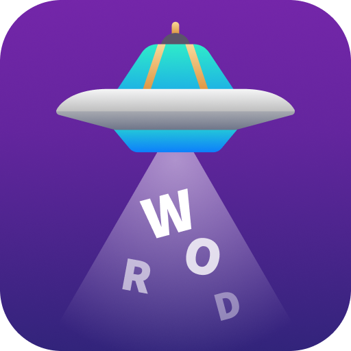
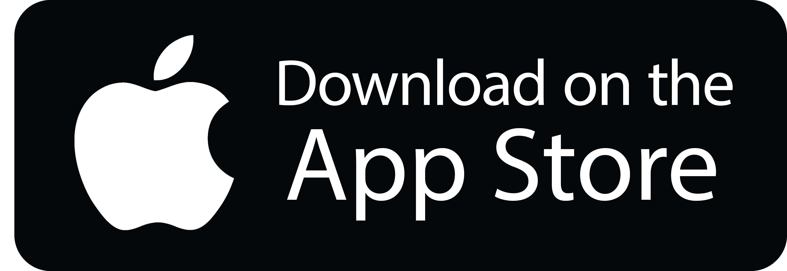

<!-- PROJECT SHIELDS -->
<!--
*** I'm using markdown "reference style" links for readability.
*** Reference links are enclosed in brackets [ ] instead of parentheses ( ).
*** See the bottom of this document for the declaration of the reference variables
-->
[![Contributors][contributors-shield]][contributors-url]
[![Forks][forks-shield]][forks-url]
[![Stargazers][stars-shield]][stars-url]
[![LinkedIn][linkedin-shield]][linkedin-url]


<!-- PROJECT LOGO -->
<br />
<h6 align="center">Paul Loots IDV 304</h6>
<br />
<br />
<p align="center">
   
  <a href="https://github.com/PaulLoots/Word-Space">
    
  </a>
  
  <h3 align="center">Word Space</h3>

  <p align="center">
    out emotion your friends
    <br />
    <a href="#about-the-project"><strong>Explore the docs »</strong></a>
    <br />
    <br />
    <a href="https://youtu.be/Hsav9FGcjAY">View Demo</a>
    ·
    <a href="https://youtu.be/38BEuaZgzKQ">Watch Reveal</a>
  </p>
  <br/>
  <p align="center">
     <a href="https://apps.apple.com/us/app/word-space/id1484544526">
       
     </a>
  </p>
</p>


<!-- TABLE OF CONTENTS -->
## Table of Contents

* [About the Project](#about-the-project)
  * [AI](#ai)
  * [Built With](#built-with)
* [Getting Started](#getting-started)
  * [Prerequisites](#prerequisites)
  * [Installation](#installation)
* [Features](#features)
   * [Avatar](#avatar)
   * [Multiplayer](#multiplayer)
   * [Sentences and Score](#sentences-and-score)
   * [Scoreboard](#scoreboard)
   * [Dark Mode](#dark-mode)
* [Contributing](#contributing)
* [License](#license)
* [Contact](#contact)


<!-- ABOUT THE PROJECT -->
## About The Project

[![Product Name Screen Shot][product-screenshot]](https://youtu.be/oszimryB3aU)

Do you have what it takes to communicate with humans? Find out and play with your friends in this epic word game.

Word Space is a language game that uses a powerful AI to determine your ability to communicate. Join your friends in this multiplayer game and see who can score the highest while laughing at the ridiculous sentences you construct along the way.

The brief for this project was to conceptualise and create a simple application using machine learning, focused either on novelty or on accessibility.

### AI

This project uses the Watson Tone Analyser which can understand emotions and communication style in text.

IBM's Watson is a question-answering supercomputer that uses artificial intelligence to perform cognitive computing and data analysis. Watson performs deep-level input analysis to present accurate answers to questions generated by humans.

### Built With

* [Xcode](https://developer.apple.com/xcode/)
* [Swift](https://developer.apple.com/swift/)
* [Firebase](https://firebase.google.com)
* [IBM Watson Tone Analyser](https://www.ibm.com/watson/services/tone-analyzer/)


<!-- GETTING STARTED -->
## Getting Started

To get a local copy up and running follow these simple steps.

### Prerequisites

For development, Xcode 11 or newer is required. The latest version can be downloaded from [here](https://developer.apple.com/xcode/resources/).

### Installation
 
1. Clone the repo
```sh
git clone https:://github.com/PaulLoots/Word-Space.git
```
2. Open the project

Open in Xcode 11 or later.

3. Install Cocapods
```sh
cd your/directory
pod install
```


<!-- FEATURES -->
## Features

### Avatar

![image1][image1]

Choose your alien and name. Each alien has a colour which is reflected throughout the UI.

### Multiplayer

![image2][image2]

Play with all your friends. There is no limit to how many people can join a game!

### Sentences and Score

![image3][image3]

Construct a sentence by selecting words. The watson AI will then give you a score based on how well your sentence adheres to the round's emotion catagory. 

### Scoreboard

![image4][image4]

See everyones sentences and give your favorites a thumbs up. In the end the favorite sentence will be featured on the leaderboard.

### Dark Mode

![image5][image5]

Word Space fully supports iOS 13 dark mode.

<!-- CONTRIBUTING -->
## Contributing

Contributions are what make the open source community such an amazing place to be learn, inspire, and create. Any contributions you make are **greatly appreciated**.

1. Fork the Project
2. Create your Feature Branch (`git checkout -b feature/AmazingFeature`)
3. Commit your Changes (`git commit -m 'Add some AmazingFeature'`)
4. Push to the Branch (`git push origin feature/AmazingFeature`)
5. Open a Pull Request


<!-- LICENSE -->
## License

Distributed under the MIT License. See `LICENSE` for more information.


<!-- CONTACT -->
## Contact

Paul Loots - [@paullootsdesign](https://www.instagram.com/paullootsdesign/) - paulloots@me.com

Project Link: [https://github.com/PaulLoots/Word-Space](https://github.com/PaulLoots/Word-Space)


<!-- MARKDOWN LINKS & IMAGES -->
<!-- https://www.markdownguide.org/basic-syntax/#reference-style-links -->
[contributors-shield]: https://img.shields.io/github/contributors/PaulLoots/Word-Space.svg?style=flat-square
[contributors-url]: https://github.com/PaulLoots/Word-Space/graphs/contributors
[forks-shield]: https://img.shields.io/github/forks/PaulLoots/Word-Space.svg?style=flat-square
[forks-url]: https://github.com/PaulLoots/Word-Space/network/members
[stars-shield]: https://img.shields.io/github/stars/PaulLoots/Word-Space.svg?style=flat-square
[stars-url]: https://github.com/PaulLoots/Word-Space/stargazers
[issues-shield]: https://img.shields.io/github/issues/PaulLoots/Word-Space.svg?style=flat-square
[issues-url]: https://github.com/PaulLoots/Word-Space/issues
[license-shield]: https://img.shields.io/github/license/PaulLoots/Word-Space.svg?style=flat-square
[license-url]: https://github.com/PaulLoots/Word-Space/master/LICENSE.txt
[linkedin-shield]: https://img.shields.io/badge/-LinkedIn-black.svg?style=flat-square&logo=linkedin&colorB=555
[linkedin-url]: https://www.linkedin.com/in/paullootsdesign
[product-screenshot]: Images/1.png
[image1]: Images/2.png
[image2]: Images/3.png
[image3]: Images/4.png
[image4]: Images/5.png
[image5]: Images/6.png
